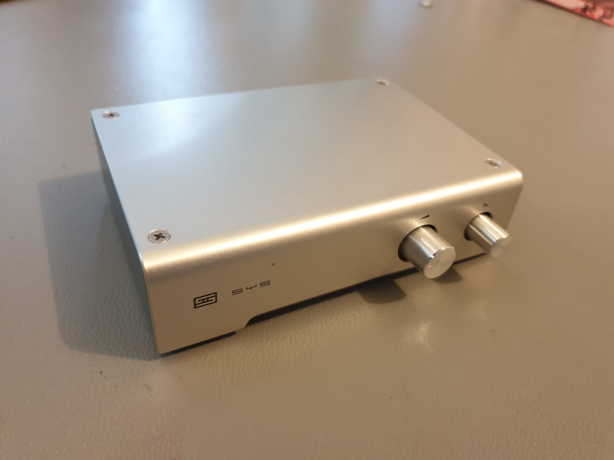
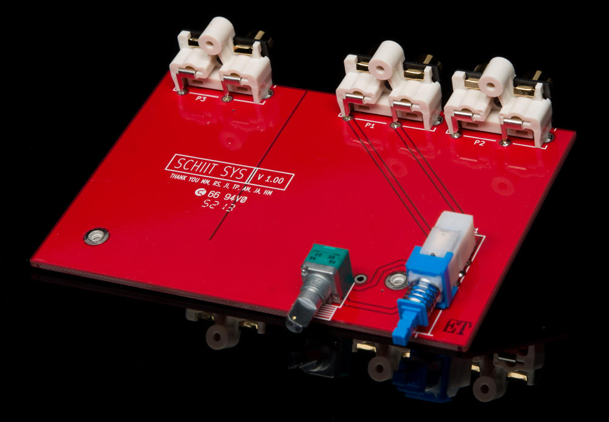
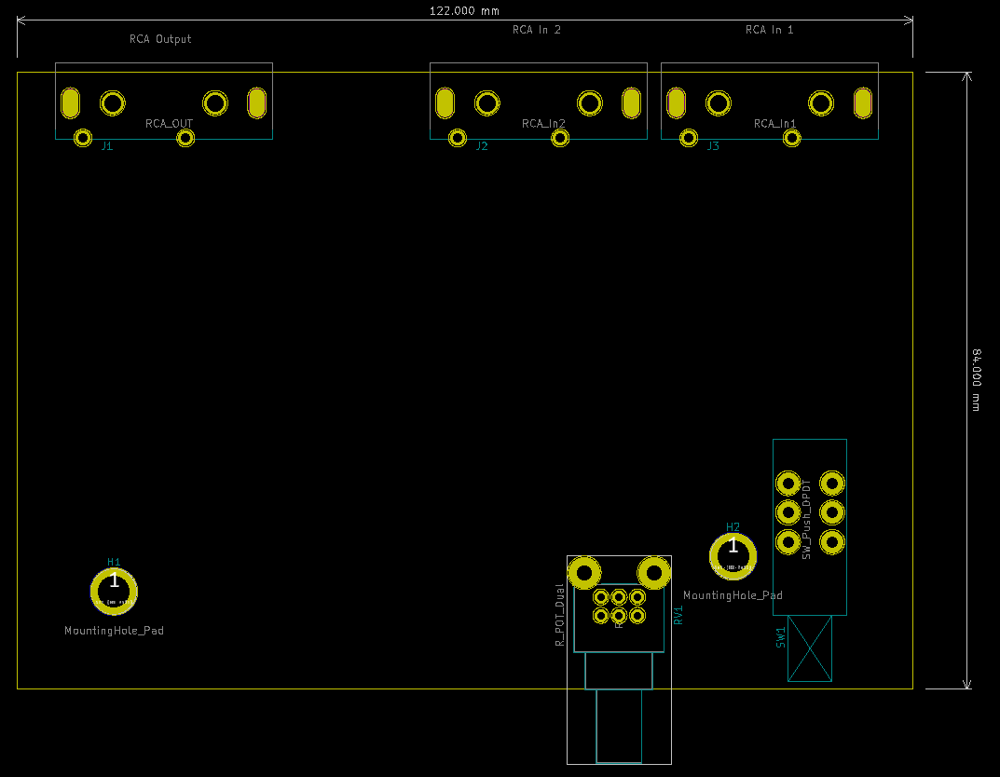

# SYS Project Template

A template KiCad project for building projets that fit into the the enclosure
of a [Schiit Sys](https://www.schiit.com/products/sys) 'Passive Preamp' - such as my [Sys Step Attenuator](www.github.com/TheSchilk/SYS_ProjectTemplate.git)

Case:

Original PCB:

(Picutre taken from schiit.com)

Template PCB:

## Parts

I don't know if the following are the exact original parts, but they will
fit:

| *Description*  | *Part*             |
|----------------|--------------------|
| Potentiometer  | Alps RK09L         |
| Switch         | Alps SPUN191400    |
| RCA Connectors | KobiCon 161-4220-E |

